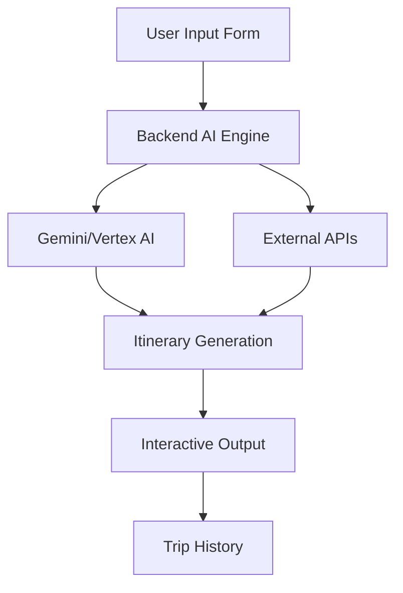

# Trip Planner Architecture Diagram

## Architecture Diagrams (Markdown Preview Mermaid Support)

> **Note:** If the diagrams below do not render, install the "Markdown Preview Mermaid Support" extension in VS Code.



## Detailed Architecture Diagram

```mermaid
flowchart TD
    User[User] --> Frontend[Frontend App (React Web/App)]
    Frontend --> Backend[Backend (FastAPI, AI)]
    Backend --> MCP[MCP Layer (API Connectors)]
    Backend --> DB[User Database (PostgreSQL)]
    Backend --> AI[AI/ML Models (Gemini, Vertex)]
    MCP --> APIs[External APIs (Flights, Hotels, Weather, Payments)]
    AI --> Itinerary[Personalized Itinerary]
    Backend --> Itinerary
    Itinerary --> Frontend
```
