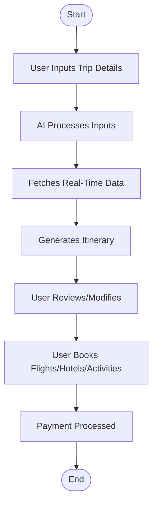

# Trip Planner Flowchart & Use Case Diagram

> **Note:** If the diagrams below do not render, install the "Markdown Preview Mermaid Support" extension in VS Code.

## Flowchart: Trip Planning Process



## Use Case Diagram: Trip Planner System

```mermaid
%% Mermaid UML usecase diagram
usecaseDiagram
    actor User
    actor Admin
    User --> (Enter Trip Details)
    User --> (View Personalized Itinerary)
    User --> (Modify Itinerary)
    User --> (Book Flights/Hotels/Activities)
    User --> (Make Payment)
    User --> (View Trip History)
    Admin --> (Manage APIs)
    Admin --> (Monitor System)
```
